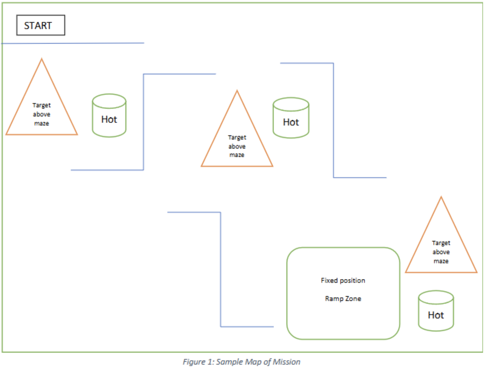

# 🔗 Navigation

- [Home](index.md)
- [The Challenge](challenge.md)
- [General System](general-system.md)
- [Software Subsystem](software.md)
- [Mechanical Subsystem](mechanical.md)
- [Electrical Subsystem](electrical.md)
- [Thermal Subsystem](thermal.md)
- [End User Documentation & BOM](user_docs.md)
- [Areas for Improvement](improvements.md)

---

# The Challenge

## Problem Definition

This project aims to design and develop an autonomous mobile robot capable of navigating a maze-like environment, detecting heat sources, and engaging with them by performing a launch task. The robot simulates a deployed unit in a thermal response scenario, where it must autonomously locate and engage “hot” targets placed throughout the maze.

The robot begins at a fixed starting point and must independently traverse a series of corridors, guided by onboard sensors and logic. Throughout the maze, cylindrical thermal sources simulate objects of interest in the mission environment, such as trapped individuals or overheated machinery.

To address this challenge, the robot integrates multiple core subsystems:

- A navigation system based on the ROS2 Nav2 stack and LDS LiDAR  
- A heat detection system built from dual AMG8833 infrared cameras  
- A custom projectile launcher powered by dual brushless flywheels  
- An onboard decision-making script that transitions between exploration, targeting, and engagement modes  

All modules are governed by a centralized controller that manages sensor fusion, state transitions, and real-time response. The system must operate under power and processing constraints typical of field-deployable mobile robots. The operational framework necessitates successful navigation through the environment within a **25-minute execution window**. This project thereby simulates a complete response pipeline, from exploration and detection to engagement.

An example of the maze is given below._

---

## Mission Objectives

### Core Objectives

The robot is designed to accomplish the following core objectives within a constrained arena environment:

1. **Autonomous Navigation**  
   The robot must independently traverse a maze-like arena without human input, using onboard LiDAR and the Nav2 ROS stack to perform real-time mapping, localization, and path planning. It must avoid obstacles, explore unmapped areas, and update its occupancy grid accordingly.

2. **Thermal Source Detection**  
   The robot uses two AMG8833 thermal cameras mounted at the front-left and rear-right. These sensors continuously scan their respective fields of view, returning 8×8 temperature grids. Upon detecting a reading above a defined threshold, the robot fuses LiDAR data to localize the heat source in world coordinates and stores it for later engagement.

3. **Targeted Launch Mechanism**  
   After the mapping phase, the robot sequentially navigates to detected thermal sources. At each location, it aligns itself and activates a dual-flywheel launcher to fire a ping pong ball toward the source. This simulates delivering a payload, aid package, or performing a mark or alert in a real-world operation.

4. **Full-System Integration**  
   All subsystems—thermal sensing, LiDAR navigation, actuation, and launching—are integrated through a centralized ROS2 node (`GlobalController`). This controller manages state transitions (e.g., Exploratory Mapping → Goal Navigation → Launching), task coordination, and fault recovery (e.g., ramp detection via IMU). The integration enables smooth and autonomous execution of the mission from start to finish.

---

### Project Deliverables

| Stakeholder Requirement                              | Project Deliverable                                                                                   |
|------------------------------------------------------|--------------------------------------------------------------------------------------------------------|
| Traverse the map autonomously from the start zone    | Real-time LiDAR-based mapping and localization to navigate the arena from a fixed starting point       |
| Navigate through a maze-like layout                  | Autonomously avoid obstacles and explore unknown regions using Nav2 and frontier exploration           |
| Detect and identify thermal sources                  | Use dual AMG8833 thermal cameras to detect and log distinct heat-emitting targets                      |
| Localize heat source positions                       | Use LiDAR-thermal fusion to determine the real-world coordinates of detected heat sources              |
| Engage heat sources                                  | Navigate to each heat source and activate a flywheel launcher to fire a ping pong ball at the source   |
| Simulate full autonomous pipeline                    | Execute the complete sequence from mapping to targeting and launching without human intervention       |

---

### Functional Requirements

| Stakeholder Requirement       | Functional Requirement                                                                                   |
|------------------------------|-----------------------------------------------------------------------------------------------------------|
| Autonomous Navigation         | Use SLAM techniques to create and refine a map of the maze environment in real-time                      |
| Obstacle Avoidance           | Use LiDAR and path planning algorithms to detect and avoid static obstacles                              |
| Thermal Detection             | Continuously process incoming temperature grids to identify heat sources above a threshold               |
| Coordinate Calculation        | Fuse LiDAR-derived distance/angle with robot pose to get real-world coordinates of heat sources          |
| Launching Mechanism           | Activate dual-flywheel launcher upon reaching target locations                                           |
| Sensor Fusion & Task Transitions | Seamlessly switch between exploration, goal navigation, and launching based on feedback and progress   |

---

### Non-functional Requirements

| Requirement Category | Non-functional Requirement                                                                                       |
|----------------------|------------------------------------------------------------------------------------------------------------------|
| Performance          | Complete the full mission within a 25-minute time frame                                                          |
| Reliability          | Tolerate sensor noise and environment variability through multiple runs                                          |
| Safety               | Avoid collisions and ensure flywheel activation only when stationary at a valid launch point                     |
| Power Efficiency     | Optimize execution for energy efficiency to preserve battery life                                                |
| Accuracy             | Maintain localization error within ±15 cm and false positive rate < 5%                                           |
| Scalability          | Support enhancements such as added sensors or more complex logic                                                 |
| Maintainability      | Design modularly to allow easy diagnostics and repairs                                                           |
| Usability            | Ensure intuitive startup, calibration, and monitoring processes                                                  |
| Verification         | Log all detection events, goal positions, and launch triggers for debugging and verification                     |

---

### Constraints

| Constraint           | Description                                                                                                     |
|----------------------|------------------------------------------------------------------------------------------------------------------|
| Physical Dimensions  | Must be compact enough to navigate narrow maze paths                                                            |
| Weight Limitations   | Must maintain a low center of gravity and stable mass to handle ramp and maintain speed and efficiency         |
| Power Limitations    | Operate using a single 11.1V 3C LiPo battery, with buck converter for Raspberry Pi and sensors                  |
| Sensor Availability  | Only off-the-shelf, ROS2-compatible sensors (LDS LiDAR, AMG8833, MLX90614) may be used                          |
| Onboard Processing   | All computation must run on a Raspberry Pi 4B, limiting complex image or point cloud algorithms                 |
| Environmental Conditions | Must be robust to indoor lighting variability and surface irregularities within the testing arena          |
| Budget               | Must be built under a S$80 budget, including sensors, launcher, wiring, and chassis materials                  |

--- 
## [General System](general-system.md)
