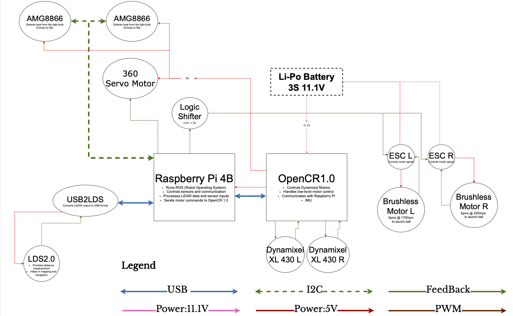
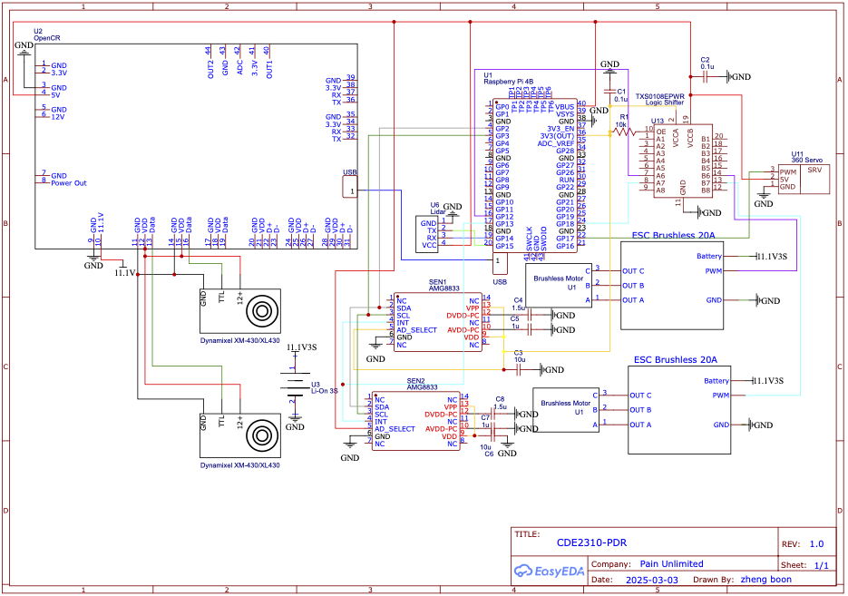
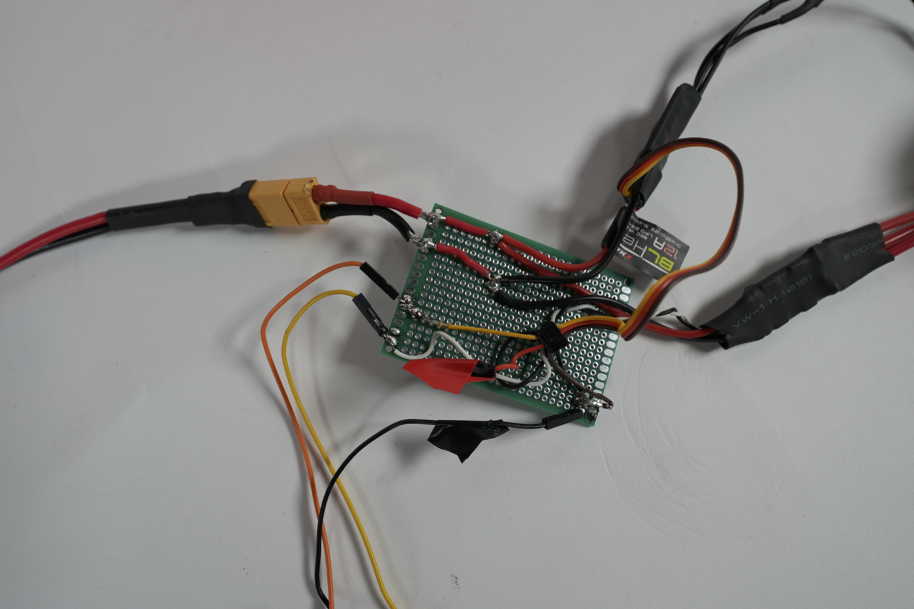
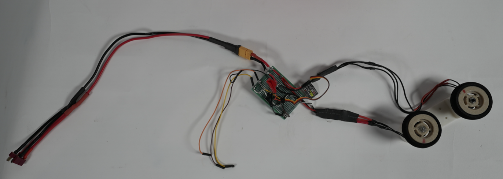

# 🔗 Navigation

- [Home](index.md)
- [The Challenge](challenge.md)
- [General System](general-system.md)
- [Software Subsystem](software.md)
- [Mechanical Subsystem](mechanical.md)
- [Electrical Subsystem](electrical.md)
- [Thermal Subsystem](thermal.md)
- [End User Documentation & BOM](user_docs.md)
- [Areas for Improvement](improvements.md)

---

# Electrical Subsystem

The electrical subsystem outlines the required components that are critical for the mission. This includes the flywheel sizing, power budget, flowchart, electrical circuit diagram and connections.

### Flywheels

The launcher must propel a standard ping pong ball to a vertical height of at least 1.5 meters at the heat source.

Using the kinematics formula:

**v² = u² + 2as**  
**v² = 0² + 2 × (-9.81 × 1.5)**  
**V = 5.4249 m/s**

Using the linear-to-angular velocity relation:

**N = (60 × Vf) / (π × d)**

Where:  
- **d** = flywheel diameter  
- **Vf** = exit velocity  
- **N** = RPM

| Flywheel Diameter (mm) | RPM      |
|------------------------|----------|
| 30                     | 3449 RPM |
| 35                     | 2956 RPM |
| 40                     | 2587 RPM |
| 45                     | 2300 RPM |
| 50                     | 2069 RPM |
| 57                     | 1820 RPM |

Our flywheel size will be 57mm.

---

In normal operation, the likely throttle will be 10% since it is a large flywheel.

Assumed overall efficiency: 50%, to account for:
- Frictional losses  
- Suboptimal contact with ping pong ball  
- Interference fit inefficiencies

We are using two flywheels spinning in opposite directions.

Thus, each flywheel must run at: **1820 / 2 = 910 RPM**  
This gives us a total RPM of 910 × 2 = **1820 RPM**

#### Motor Performance and Power Budget

- Motor rated max RPM: 24,975 RPM
- Motor current at max RPM = 6.5 A
- Expected throttle in real usage: 10%
  - At 10% throttle:  
    **(24,975 / 100) × 10 = 2497.5 RPM**  
    > 1820 RPM required → Sufficient for mission
- Motor current at 10% throttle:  
  **6.5 / 10 = 0.65 A**
- Total current for 2 motors:  
  **0.65 × 2 = 1.3 A**
- Power at 11.1V (3S LiPo):  
  **1.3 A × 11.1 V = 14.43 W**

### Power Budget

| Components                      | Voltage(V) | Current(A) | Wattage(Maximum)(W) |
|-------------------------------|------------|------------|----------------------|
| Turtlebot max speed           | 11.1       | 0.99       | 12.3                 |
| Turtlebot idle                | 11.1       | 0.81       | 9                   |
| Feetech FS90R Micro Servo     | 5          | 0.8        | 4                   |
| AMG8866 x 2                   | 3.3V       | 0.0045     | 0.0297              |
| Motor of flywheel x2          | 11.1       | 1.68       | 14.43               |
| Speed controller x2 (90% eff) | 11.1       | 0.12       | 1.33                |
| TXS0108E Level Converter      | 5          | ~0         | ~0                  |

> The logic converter is set to 0 as it draws 8×10^-6 A at worst.

### Battery Life Estimation

#### Battery Specifications (TurtleBot3 Standard LiPo)
- Voltage: 11.1V
- Capacity: 1800mAh (1.8Ah)
- Energy: **11.1 V × 1.8 Ah = 19.98 Wh**
- Average Power Usage (From Testing): 11W

#### Ideal Runtime (100% Efficiency)
**Battery Life = 19.98 Wh / 11 W = 1.816 hours = 109 minutes**

#### Adjusted Runtime (70% Real-World Efficiency)
**109 × 0.7 = 76.3 minutes**

#### Mission Duration Feasibility
- Single mission duration: 25 minutes
- Available runtime: ~76 minutes
- **76.3 / 25 = ~3 full missions possible**

> The TurtleBot3 battery provides enough power to complete the mission at least three times under real-world conditions, at 30% inefficiency.

---

### Electrical Subsystem Connections

The electrical subsystem integrates sensor feedback, PWM motor control, and power distribution for the launcher mechanism and TurtleBot3 operations as shown here:

*The circuit of the turtlebot is shown here*

#### IR Sensor (AMG8833) Connection

- Sensor Type: AMG8833 IR thermal camera
- Interface: I2C
- Wiring:
  - SDA (Data) → GPIO2 (BCM)
  - SCL (Clock) → GPIO3 (BCM)

> These sensors detect the heat signature of the target area and are connected directly to the Raspberry Pi I2C interface.

#### Flywheel Motor Control

- Motors: 2 × Brushless DC Motors
- Control Interface: ESC (Electronic Speed Controller)
- Signal Requirement: 50Hz PWM, with a 1ms–2ms pulse width:
  - 1ms = minimum throttle
  - 2ms = maximum throttle
- PWM Control Pins (BCM mode):
  - Left Motor → GPIO18
  - Right Motor → GPIO12

> Raspberry Pi GPIO outputs are 3.3V logic, but ESCs require a 5V signal. A logic level shifter is used to step up the PWM signals to 5V.

---

### Rack and Pinion Servo (Continuous Rotation)

**Motor Type:** 360° Continuous Servo

- **Signal Requirement: 50Hz PWM:**
  - 1ms = full reverse  
  - 1.5ms = stationary  
  - 2ms = full forward

- **PWM Control Pin:**
  - Servo Motor → GPIO17  
  - Power Distribution

- **ESC Power Input:**
  - Supplied via a split power connector (as shown in images) from the Raspberry Pi's power input path.  
  - Shared 11.1V source from main LiPo battery.

- **5V & GND (Signal Side):**
  - Sourced directly from the Raspberry Pi 5V and GND rails.  
  - Common ground is ensured for consistent PWM signaling.  
  - *Note: The OpenCR is powering the Raspberry Pi*

---

### Connections

**Shown in the pictures:**  
Battery split into TurtleBot and towards ESC.  
The wire is split again into ESC L and ESC R.  
The 3 jumper cables are for the ESCs and common ground.

## Testing and Validation  
---

### Problems with Motor Calibration

- Significant differences in ESC calibration methods between manufacturers were discovered during the initial motor startup.  
- Uneven motor speeds between the left and right flywheels were caused by certain ESCs that needed different throttle sequences to calibrate.  
- A firmware mismatch was probably the cause of one ESC's improperly calibrated starting throttle point.  
- Due to a lack of compatible firmware flashing utilities, attempts to reflash the ESC using Arduino tools failed.

---

### Unbalanced Flywheel Speed

- One flywheel continuously spun more slowly than the other, even though it was not difficult to reach a projectile height of 1.5 meters.  
- The ball veered sideways due to this imbalance, occasionally striking walls before hitting the ceiling.  
- To balance the velocities, a manual software offset was added to the flywheel PWM signal.  
- Our issue was to keep the system from overshooting and hitting the ceiling, not to get enough power like other groups were trying to do.

---

### Problems with Servo Upgrade and Positioning

- In order to actuate the rack and pinion for vertical ping pong ball movement, the original 180° servo lacked the necessary angular range.  
- A 360° continuous rotation servo, which employs PWM for speed control rather than position control, replaced the previous system.  
- Due to the lack of an absolute position reference, actuation timing had to be carefully adjusted using a helper function, which added complexity.

---

### Jittering Servo Motor during ROS Startup

- GPIO noise during Raspberry Pi startup caused jitter in the servo motor when launching ROS2 (via `ros2 run` or `ros2 launch`).  
- The rack and pinion moved erratically as a result of this jitter.  
- Software attempts to reduce the jitter were unsuccessful because the movement amplitude fluctuated erratically.  
- Manually readjusting the servo position in between runs is a temporary fix.  
- A limit switch at the tube's base is suggested as a future solution to enable the servo to self-calibrate its depth, increasing repeatability and dependability.