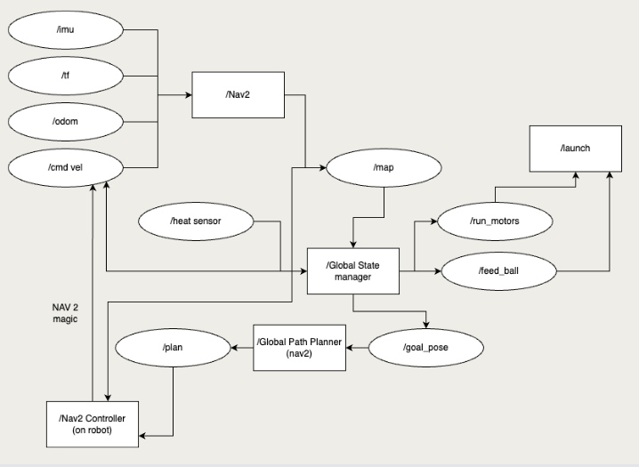

# 🔗 Navigation

- [Home](index.md)
- [The Challenge](challenge.md)
- [General System](general-system.md)
- [Software Subsystem](software.md)
- [Mechanical Subsystem](mechanical.md)
- [Electrical Subsystem](electrical.md)
- [Thermal Subsystem](thermal.md)
- [End User Documentation & BOM](user_docs.md)
- [Areas for Improvement](improvements.md)

---

# General System


We have decomposed the system into four interdependent subsystems:

- **Navigation (Bot)**  
  Handles real-time path planning, localization (via LIDAR and odometry), and map generation using the ROS2 Nav2 stack.

- **Navigation (Laptop)**  
  Visualizes map data, monitors robot state via RViz and topics, and can support external decision logging or override mechanisms.

- **Heat Detection**  
  Uses dual AMG8833 thermal sensors, feeding temperature grids into the controller. Detection triggers further localization using filtered LIDAR data to identify global heat source coordinates.

- **Launcher**  
  A dual flywheel launching mechanism actuated by motor commands. The launcher is synchronized with navigation goals to engage detected heat targets.

---

Each Subsystem is controlled by a global controller that handles all high level logic, this was conveyed to each subsystem using ROS2 Topics, the RQT graph for communication is below:


## GlobalController: The Brain of the Bot

The `GlobalController` Python node runs in multi-threaded execution, enabling:

- **Sensor polling at 10 Hz** via the fast loop for IMU, LIDAR, and temperature grid updates
- **State decision-making at 1 Hz** in the control loop
- **Concurrent execution** of callbacks and services

It handles:
- State transitions across states such as:
  - `Exploratory_Mapping`
  - `Goal_Navigation`
  - `Launching_Balls`
  - `Imu_Interrupt`
  - `Attempting_Ramp`
- Autonomous heat source targeting using a KMeans-based clustering algorithm

## Concurrency & Multithreading

The node leverages a `MultiThreadedExecutor` with **concurrent timers** and **sensor callbacks**, ensuring responsive, real-time robot control:
- **Fast Loop (10 Hz)**:  
  Executed using `self.fast_timer`, this loop:
  - Monitors **IMU pitch changes** for hazard detection
  - Quickly cancels active goals if a ramp or incline is detected (`Imu_Interrupt`)
  - Publishes live visualization markers (`publish_visualization_markers`)
  - Avoids blocking calls to ensure low-latency sensor response

- **Control Loop (1 Hz)**:  
  Executed using `self.control_loop_timer`, this loop:
  - Makes **high-level decisions** based on current FSM state
  - Triggers **frontier exploration** (`dijk_mover`), **goal navigation**, and **ramp handling**
  - Performs **goal planning** and **ball launching logic**


## System Flow Overview

1. **Startup Phase**  
   Upon initialization, the robot begins in the `Initializing` state, waiting for valid map and sensor data. Once available, it enters the `Exploratory_Mapping` phase.

2. **Exploration Phase**  
   The robot autonomously explores the maze using frontier-based navigation. As thermal targets are detected, their global coordinates are recorded and visualized in RViz.

3. **Clustering & Goal Planning**  
   After the map is completed, detected heat points are clustered into goal positions. The robot then sequentially navigates to each target.

4. **Launching Phase**  
   At each goal, the robot stops, aligns itself, and launches a ping pong ball toward the heat source using the dual flywheel launcher.

5. **IMU Interrupt Handling**  
   During any phase, if a pitch anomaly is detected (e.g., going up a ramp), the system triggers the `Imu_Interrupt` state. The robot cancels current goals, marks unsafe zones in the occupancy grid, and replans its route.

6. **Ramp Engagement (Optional)**  
   If enabled, after all heat targets are engaged, the robot attempts to approach a ramp zone and perform a final launch

---

## Sensor Fusion & Decision Logic

- **Thermal + LIDAR Fusion**  
  When heat is detected, a laser scan in the direction of the sensor’s FOV is filtered and binned. The average angle and distance are computed and transformed into world coordinates.

- **IMU Feedback Loop**  
  Pitch data is processed in real-time. A rolling average is used to detect sudden inclinations that may signal a ramp or collision.

- **Occupancy Grid Manipulation**  
  The robot actively updates its map, sealing off dangerous or previously explored zones using adaptive flood-fill techniques and direct occupancy marking.

---

## Communication Infrastructure

All modules interact via ROS2 topics with appropriate QoS profiles. Key topics include:

- `cmd_vel`: Motion commands
- `scan`: Laser data
- `odom`: Odometry
- `temperature_sensor_1/2`: Heat grid data
- `flywheel`: Launch trigger
- `/visualization_markers`: Real-time RViz feedback for heat and sealed regions

> Communication is optimized for real-time response and modularity, with feedback loops embedded into every decision node.

---

## Why This Design?

This architecture allows us to:
- Run real-time behaviors in parallel
- Decompose complex behavior
- Replan dynamically based on ramp location, sensor feedback, or BT tree failure


### Extra information on State Transitions and how they are actually defined in the code


#### 1. Transition from `Initializing` → `Exploratory_Mapping`

```python
def initialise(self):
    self.wait_for_map()
    pos = self.get_robot_global_position()
    while pos is None:
        pos = self.get_robot_global_position()
        time.sleep(0.2)
    x , y , yaw = pos
    self.initial_yaw = yaw
```

- This method waits for an occupancy grid (`wait_for_map`) and valid TF position before setting the robot’s initial orientation.  
- Then, `self.set_state(GlobalController.State.Exploratory_Mapping)` is called in the `control_loop`.

---

#### 2. Transition to `Imu_Interrupt`

```python
def fast_loop(self):
    ...
    if self.IMU_interrupt_check() and not self.hit_ramped:
        self.set_state(GlobalController.State.Imu_Interrupt)
```

- This transition can occur during `Exploratory_Mapping`, `Goal_Navigation`, or `Go_to_Heat_Souce`.
- The trigger is based on `self.recent_pitch_avg > self.imu_threshold * self.global_pitch_avg` or `> self.imu_abs_threshold`.

---

#### 3. Transition from `Imu_Interrupt` → `Exploratory_Mapping`

```python
def control_loop(self):
    ...
    elif bot_current_state == GlobalController.State.Imu_Interrupt:
        self.hit_ramped = True
        self.ramp_location = self.get_robot_grid_position()
        self.mark_area_around_robot_as_occ(self.ramp_location[0], self.ramp_location[1], 7)
        x ,y, yaw = self.previous_position[0]
        self.nav_to_goal(x,y)
        time.sleep(20)
        self.set_state(GlobalController.State.Exploratory_Mapping)
```

- After marking the ramp location as occupied and reversing, the robot returns to mapping with the ramp avoided.

---

#### 4. Transition from `Exploratory_Mapping` → `Goal_Navigation`

```python
def control_loop(self):
    ...
    if self.finished_mapping:
        self.max_heat_locations = self.find_centers(self.clusters)
        self.set_state(GlobalController.State.Goal_Navigation)
```

- Triggered when `self.finished_mapping` is `True` (after all frontiers explored via `dijk_mover()`).

---

#### 5. Transition to `Launching_Balls`

```python
def control_loop(self):
    ...
    for location in self.max_heat_locations:
        ...
        self.nav_to_goal(world_x, world_y)
        ...
        self.launch_ball()
    self.set_state(GlobalController.State.Attempting_Ramp)
```

- The robot sends a Nav2 goal, then launches a ping pong ball at each goal location.
- This implicitly represents the `Launching_Balls` state as a sub-action before transitioning to `Attempting_Ramp`.

---

#### 6. Transition to `Attempting_Ramp`

```python
def control_loop(self):
    ...
    elif bot_current_state == GlobalController.State.Goal_Navigation:
        ...
        self.set_state(GlobalController.State.Attempting_Ramp)
```

- This happens once all heat sources in `self.max_heat_locations` have been visited.

---

#### 7. Final Ascent Handling in `Attempting_Ramp`

```python
def control_loop(self):
    ...
    elif bot_current_state == GlobalController.State.Attempting_Ramp:
        x,y = self.grid_to_world(self.ramp_location[0], self.ramp_location[1])
        self.nav_to_goal(x , y, self.initial_yaw)
        time.sleep(30)
        self.run_pd_until_obstacle(self.initial_yaw)
        self.launch_ball()
```

- The robot ascends the ramp and launches a final ball.

---