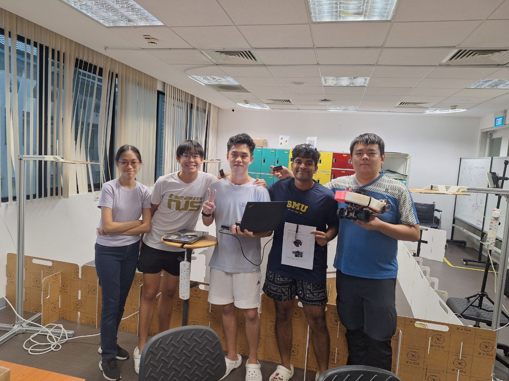

# The epitome of Innovation and Design Program Trauma Bonding

---

## At a Glance

This is a robotics project built on the ROS2 framework. It features:

- Frontier exploration and navigation using Nav2
- Thermal detection via the AMG8833 sensor
- Flywheel-based projectile launching system
- Fully simulated in Gazebo

---

## Our Robot

  <iframe 
      width="100%" 
      height="480" 
      style="border:1px solid #cccccc;" 
      src="https://3dviewer.net/embed.html#model=https://raw.githubusercontent.com/Hong-yiii/CDE2310_System_Design/main/CAD/turtlebot%20with%20launcher.STL$camera=93.42291,-333.17682,179.88174,93.73459,187.34505,-94.63919,0.00000,1.00000,0.00000,45.00000$projectionmode=perspective$envsettings=fishermans_bastion,off$backgroundcolor=255,255,255,255$defaultcolor=200,200,200$defaultlinecolor=100,100,100$edgesettings=off,0,0,0,1">
  </iframe>

### Final navitgation run at 4x speed

  <video width="640" height="360" controls style="border: 2px solid #ddd; border-radius: 12px; box-shadow: 0 2px 8px rgba(0,0,0,0.1);">
    <source src="assets/images/Final_run.mp4" type="video/mp4">
    Your browser does not support the video tag.
  </video>

---

**Breaking down the problem!:**

- [The Challenge](challenge.md)
- [General System](general-system.md)
- [Software Subsystem](software.md)
- [Mechanical Subsystem](mechanical.md)
- [Electrical Subsystem](electrical.md)
- [Thermal Subsystem](thermal.md)
- [End User Documentation & BOM](user_docs.md)
- [Areas for Improvement](improvements.md)

---

### 👥 The Team

