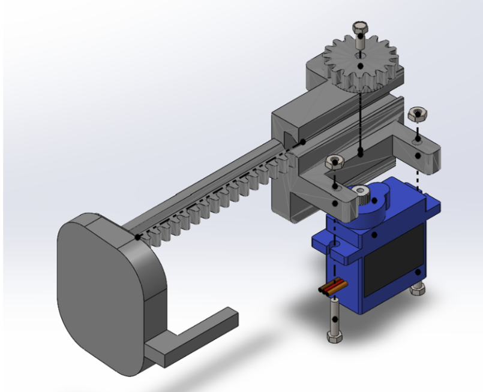
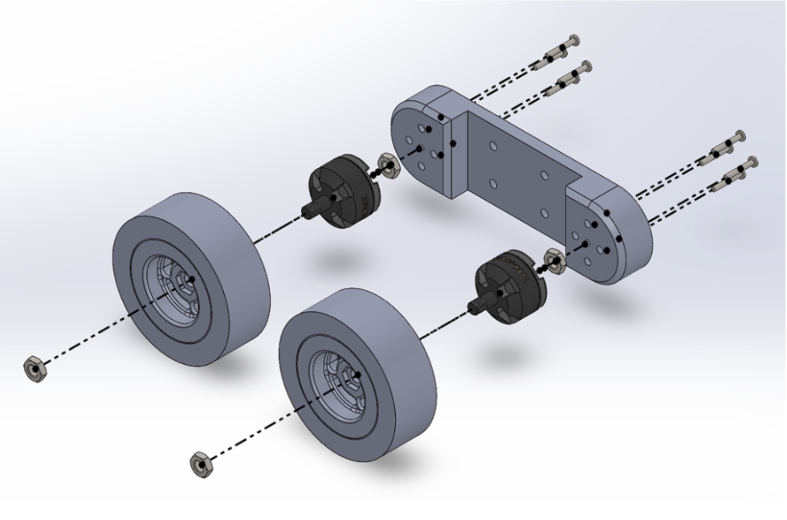
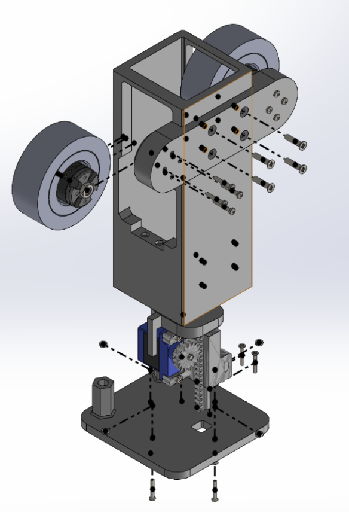
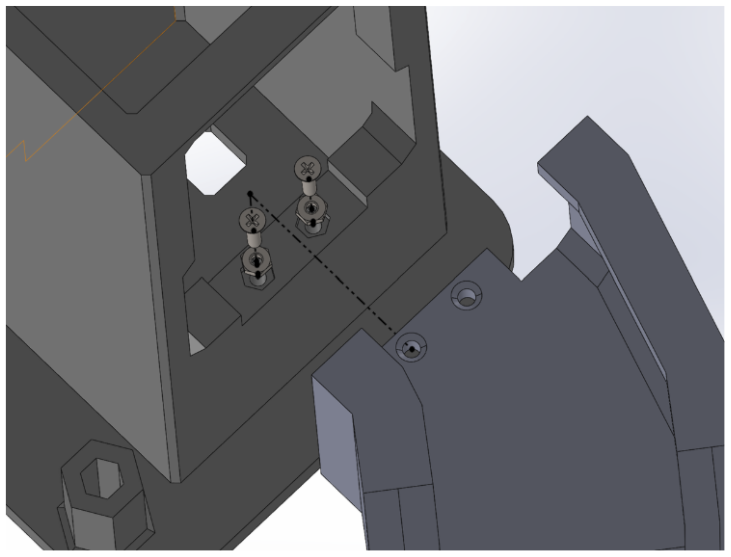
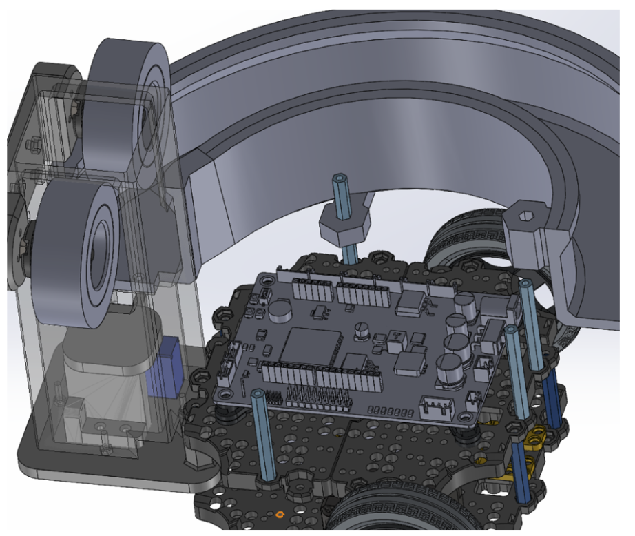
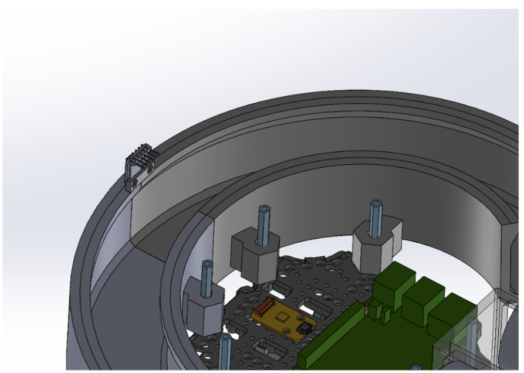
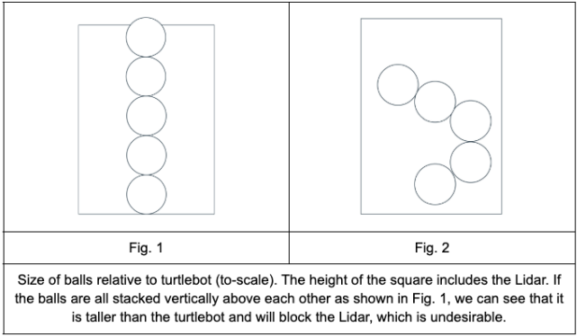
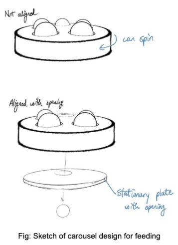
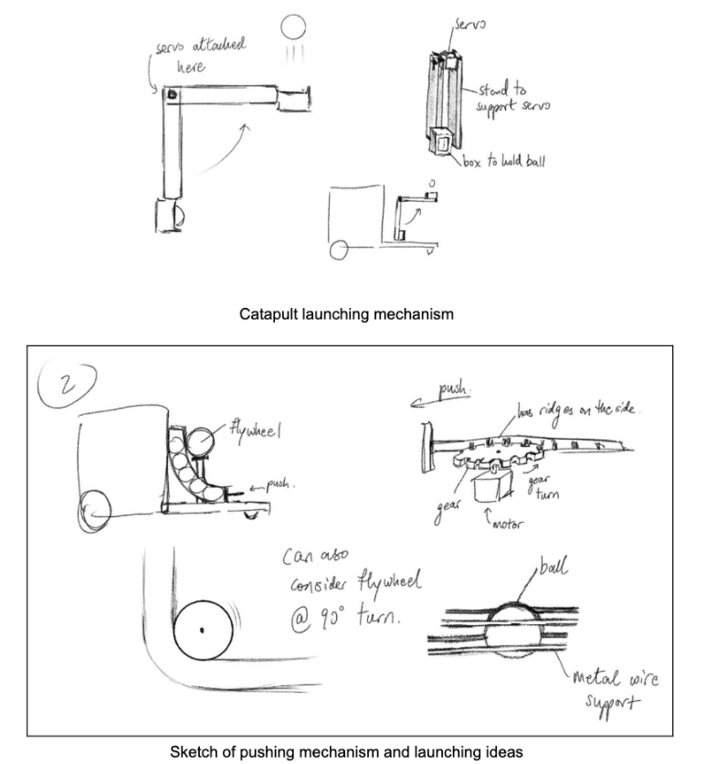
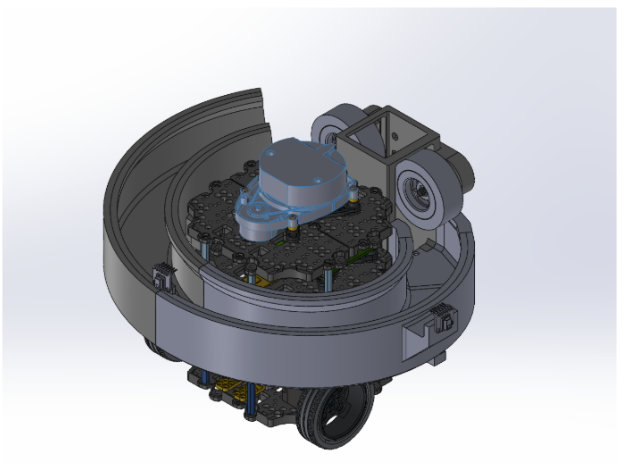

# 🔗 Navigation

- [Home](index.md)
- [The Challenge](challenge.md)
- [General System](general-system.md)
- [Software Subsystem](software.md)
- [Mechanical Subsystem](mechanical.md)
- [Electrical Subsystem](electrical.md)
- [Thermal Subsystem](thermal.md)
- [End User Documentation & BOM](user_docs.md)
- [Areas for Improvement](improvements.md)

---

# Mechanical Subsystem

## Problem description, design considerations

### - Storage
- The robot must be able to carry and securely store **nine ping pong balls**.  
- Balls must not escape during the mission. This includes during movement on ramps.  
- Lidar must not be blocked.

### - Launcher
- Must be able to launch ping pong ball to a height of **1.5m**.  
- Must be able to launch at specific intervals (**2s, 4s, 2s**).

### - Centre of Gravity
- If the CG is too high or poorly positioned, the robot is at risk of tipping over, especially when navigating inclined surfaces like ramps.  
- If the CG is towards the back of the turtlebot, it might fall over.

---

## System overview

Our system uses a **double flywheel launcher** to shoot our ping pong balls to the required height of **1.5m**. The balls are stored in a spiral around the turtlebot. Gravity pulls them down into the feeding area in the tube. Using a **rack and pinion** system, the balls are pushed between the flywheels and shot upwards.

The rack and pinion system consists of a 9g 360° servo motor and 3D-printed platform, servo motor bracket, and pinion gear.

---

## Design considerations & other possible strategies

### Storage

Vertical Stack:

Lets gravity pull the balls down into the launching mechanism. However, this will obstruct the Lidar (Fig. 1). This is easily fixed by stacking the balls in a curved tube (Fig. 2) instead of vertically on top of each other.

Curved Stack:

Stacking the balls in a curved tube will allow for more balls to be stored. However, there is still a limit to how many balls can be stacked only at the back of the bot. Thus, one option would be to stack them around the bot instead.

Reservoir:

We can hold the balls in a reservoir, all of them together in one large container at the back of the bot.

### Feeding

We have found three ways we can feed the ping pong balls into the launcher. By pushing, using a trap door, or using a carousel design.

### Launching Mechanism

For the launching mechanism, there are many different options, namely using a spring, using rubber bands to form a trampoline-like structure, and using a catapult [3]. Additionally, we could also use a single or double flywheel launcher system [4]. The flywheel can be built using a chain or belt [5] or with compound gears [6]. If the motor spins fast enough, we can attach the flywheels to the motors directly.

# Evaluation of Design Options

## 🧱 Storage Mechanisms

| Type     | Pros                                                                                          | Cons                                                                                                    | Other Notes                                                                                                                                                          |
|----------|-----------------------------------------------------------------------------------------------|---------------------------------------------------------------------------------------------------------|----------------------------------------------------------------------------------------------------------------------------------------------------------------------|
| Stacked  | - Easy to implement                                                                           | - Stacking vertically blocks the LIDAR - Requires precise push/release (risk of double firing)      | May need to angle or curve the stack, increasing complexity. Servo control must be precise to avoid feeding errors.                                                  |
| Reservoir| - Easy to implement - Doesn’t block LIDAR                                                  | - Single structure may affect stability - Risk of jamming at funnel-like taper                      | Must be tapered to allow one-ball-at-a-time release. Jamming possible if balls don't align or funnel clogs.                                                          |

---

## ⚙️ Feeding Mechanisms

| Type       | Pros                                                                                      | Cons                                                                                                     | Other Notes                                                                                                                                 |
|------------|-------------------------------------------------------------------------------------------|----------------------------------------------------------------------------------------------------------|----------------------------------------------------------------------------------------------------------------------------------------------|
| By Pushing | - Easy and reliable - Easy to sync with launcher                                       | - Limited push options - Needs precision to avoid jamming/double-feed                                | Might require a rack-and-pinion or other mechanical pusher. Misalignment or friction may cause jams. Precise motor control essential.       |
| Trap Door  | - Controls single-ball feed well - Fewer parts and lighter                             | - Relies on gravity; surface bumps or uneven terrain may disrupt feeding                                | Simpler but less robust under uneven conditions or inclined planes.                                                                         |
| Carousel   | - Doesn’t block LIDAR - Lower risk of overfeeding                                       | - Many moving parts - Large footprint can affect robot stability                                     | May require 3D printing. Complexity and size are trade-offs for reliability and LIDAR compatibility.                                         |

---

##  Launching Mechanisms

| Type             | Pros                                                       | Cons                                                                                                   | Other Notes                                                                                                                            |
|------------------|------------------------------------------------------------|--------------------------------------------------------------------------------------------------------|-----------------------------------------------------------------------------------------------------------------------------------------|
| Springs / Bands  | - Simple design - Easy to implement                     | - Unreliable launch strength - Requires tensioning mechanism - Prone to wear                     | Inexpensive and simple, but may suffer from mechanical degradation and inconsistent performance.                                       |
| Flywheel (Single)| - Reliable and steady power                                | - More moving parts - Risk of ball deformation due to compression                                   | Better performance at the cost of complexity. Must tune speed and grip to avoid damaging the ball.                                    |
| Flywheel (Double)| - Even more stable launch                                  | - Speed mismatch between wheels can cause curving shot                                                 | Requires tight control of both motors. Misalignment can result in spin or curving launches.                                            |
| Catapult Arm     | - Simple design - No special parts required             | - Launch speed inconsistent - Arm must be at least 62 cm for required height (impractical size)     | See appendix for length calculations. Simplicity undermined by scale and torque issues at required performance.                        |

# Testing and Validation

We found that the solenoid could not push a sufficient distance, so we changed the design to use a **rack and pinion system**.

---

## Iterative Design Changes

Through testing, we made various refinements:

- **Platform Fitment Issue**  
  Due to slight expansion after 3D printing, the platform did not move smoothly through the tube when the rack and pinion system was installed. This caused the servo motor to stop spinning because the required torque exceeded its stall torque.  
  ➤ **Fix**: We resized the platform to be slightly smaller, ensuring it could still push balls into the launcher effectively without needing to fit the full width of the tube.

- **Interference with Pinion Gear**  
  The original part of the platform that was meant to block other balls from going underneath would collide with the pinion gear.  
  ➤ **Fix**: We removed that portion and attached a thinner barrier to the platform to maintain the same functionality without collision.

- **Tube Mounting Stability**  
  We found that using only screws to secure the tube to the base plate and the motor mount to the tube was unreliable. Screws would often fall out mid-test.  
  ➤ **Fix**: We **inserted embedded nuts** into the tube and motor mount to improve structural rigidity.

- **Motor Mount Flexing**  
  In our first iteration, the motors were placed too close together. When the ball passed between them, it caused the mount to bend.  
  ➤ **Fix**: We redesigned the mount to be longer, positioning the motors further apart for better stability.

- **Motor Shaft Clearance Issue**  
  The motor shaft protrudes from the back of the motor, preventing the motor from sitting flush against the motor mount.  
  ➤ **Fix**: We inserted a **spacer (a nut)** between the motor and the mount to allow for a flush, stable connection.

- **Platform and Rack Integration**  
  Initially, the platform and rack were printed separately and superglued together. After refinement,  
  ➤ **Fix**: We reprinted the **platform and rack as a single part**, simplifying the assembly and improving reliability.

- **Heat Sensor Positioning**  
  Midway through development, we decided to reposition the heat sensor.  
  ➤ **Fix**: We **cut off one edge** of the original heat sensor mount and reattached it at the new position on the front of the robot.

---

## Final Design

The final design reflects multiple rounds of testing and iteration, balancing structural integrity, functional performance, and integration of sensing and actuation subsystems.

  <iframe 
      width="100%" 
      height="480" 
      style="border:1px solid #cccccc;" 
      src="https://3dviewer.net/embed.html#model=https://raw.githubusercontent.com/Hong-yiii/CDE2310_System_Design/main/CAD/turtlebot%20with%20launcher.STL$camera=93.42291,-333.17682,179.88174,93.73459,187.34505,-94.63919,0.00000,1.00000,0.00000,45.00000$projectionmode=perspective$envsettings=fishermans_bastion,off$backgroundcolor=255,255,255,255$defaultcolor=200,200,200$defaultlinecolor=100,100,100$edgesettings=off,0,0,0,1">
  </iframe>

---

## [Electrical Subsystem](electrical.md)