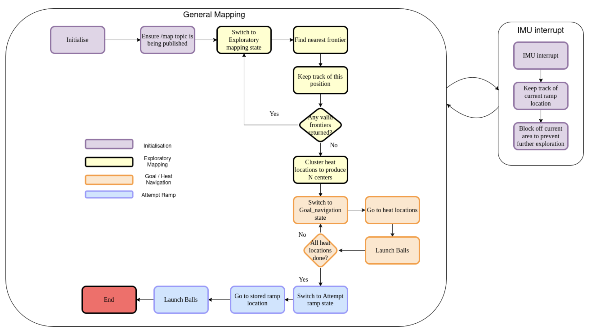
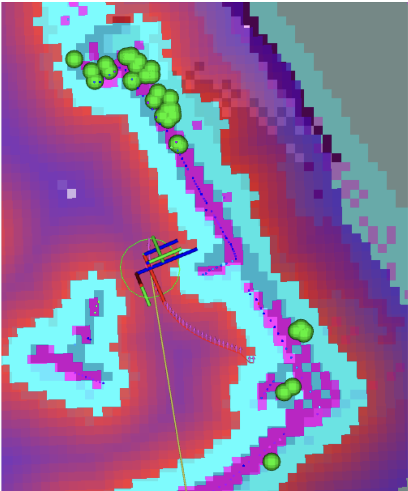

# 🔗 Navigation

- [Home](index.md)
- [The Challenge](challenge.md)
- [General System](general-system.md)
- [Software Subsystem](software.md)
- [Mechanical Subsystem](mechanical.md)
- [Electrical Subsystem](electrical.md)
- [Thermal Subsystem](thermal.md)
- [Testing & Validation](testing.md)
- [Areas for Improvement](improvements.md)

---

# Software Subsystem

## Frontier-Based Goal Selection

Our robot uses a **frontier exploration algorithm** to autonomously determine where to navigate next when the map is incomplete. The purpose of this module is to select the **nearest unexplored region** and issue its coordinates as a goal to Nav2 for execution.

Unlike traditional frontier algorithms, our custom version introduces several optimizations:

- Skips unknown cells directly under the robot, which are typically artifacts caused by sensor occlusion.
- Processes up to 9 frontier cells at once, improving performance by marking entire clusters instead of single cells.
- Avoids reprocessing previously visited frontiers by converting them to free space in the occupancy grid.
- Pads obstacles by 3 grid cells, reducing risk of selecting unreachable goals near tight corners.

This method is lightweight, fast, and effective in dynamic SLAM-generated maps.

---

### Why Dijkstra or A* Are Not Used in Frontier Selection

Dijkstra and A* are not used for frontier goal selection because frontier exploration is purely concerned with **finding proximity-based unexplored areas**, not optimal pathing through known cost maps.

| Algorithm        | Use Case                        | Weighted Cost Consideration | Suitability for Frontier Selection                                     |
|------------------|----------------------------------|------------------------------|------------------------------------------------------------------------|
| Frontier Search  | Locate nearest unknown region    | No                           | Fast, avoids unnecessary path cost analysis                           |
| Dijkstra         | Global pathfinding               | Yes                          | Overhead too high for real-time exploration                           |
| A*               | Optimized global planning        | Yes                          | Not needed – goal is not yet reachable                                |

By separating **goal discovery (frontier)** from **path execution (planner + controller)**, we maintain a clean division of concerns and improve overall system efficiency.

## Custom Frontier Algorithm and Grid Filtering

### Overview

Our custom frontier exploration module issues exploration goals to Nav2 and prevents repeated exploration. It is designed to work efficiently in real-time with minimal computational overhead.

---

### **Key Behavior**

#### 1. Frontier Detection Logic
- Begins with the robot's current position in a queue.
- Expands outward, skipping the cell directly under the robot (since it's usually unknown).
- Checks adjacent cells for unknown values not yet visited.
- Adds qualifying frontier cells to a queue and marks all 8-way neighbors as visited.
- Stops and returns a goal coordinate when a valid frontier is found.

#### 2. Occupancy Grid Filtering
- **Convert visited frontiers to free space**: Previously explored frontier cells are marked as free to prevent re-targeting.
- **Pad occupied grids**: Obstacles are padded by a 3-grid radius to provide safer clearance from walls.

---

These filtering steps are applied before frontier detection and significantly enhance both performance and navigation safety.


## Path Planning and Control Strategy

To navigate to assigned destinations within the explored map, our system uses the **Navigation2 (Nav2)** stack, which separates global path planning and local trajectory control into two distinct components. This modularity ensures scalability and enables precise control in cluttered and dynamic environments.

---

The table below summarizes the roles and tradeoffs of each navigation component:

| Component        | Role                    | Pros                                                                                 | Cons                                                  |
|------------------|-------------------------|--------------------------------------------------------------------------------------|-------------------------------------------------------|
| NavFn Planner (A*) | Global Path Planning    | - Computes shortest path using A* search with cost heuristics  <br> - Robust and well-integrated with Nav2 | - Requires a known map <br> - May produce sharp or unsmoothed paths |
| MPPI Controller  | Local Trajectory Execution | - Produces smooth motion through trajectory optimization  <br> - Performs well in tight spaces due to predictive sampling | - Requires fine-tuning <br> - Sensitive to physical robot parameters |

---

We chose the **MPPI controller** over more common options like **DWB** and **Pure Pursuit** because of its superior handling in narrow and complex environments. Based on observed behavior and prior benchmarking, MPPI offers the highest tolerance in tight spaces, followed by Pure Pursuit, and then DWB:

**MPPI > Pure Pursuit > DWB** (in terms of tight space navigation performance)

The MPPI controller continuously samples multiple control trajectories and evaluates them using a cost function. This allows it to produce smoother and more adaptable commands compared to rule-based controllers.

## System-Level Navigation Logic



### High-Level State Machine Overview

The robot’s navigation and mission execution are managed entirely by the `GlobalController` node, which employs a **finite state machine** to define clear phases of operation. Each state manages distinct tasks, utilizing sensor inputs and real-time feedback to transition between states. The primary states implemented in the system include:

1. **Initializing**
2. **Exploratory Mapping**
3. **IMU Interrupt**
4. **Goal Navigation**
5. **Launching Balls**
6. **Attempting Ramp**

---

The `GlobalController` constantly monitors sensor inputs—IMU (pitch), LIDAR, thermal sensors, and SLAM-generated occupancy grid updates—to dynamically handle state transitions and maintain safe operations.

---

### Initialization Phase (Initializing)

```python
def wait_for_map(self):
    self.get_logger().info("Waiting for initial map update...")
    while self.occdata.size == 0 or not np.any(self.occdata != 0):
        self.get_logger().warn("No occupancy grid data yet, waiting...")
        rclpy.spin_once(self)
        time.sleep(1)
    self.get_logger().info("Map received. Starting Dijkstra movement.")
``` 

Upon startup, the robot waits for two critical elements before proceeding:

- **Occupancy Grid Map (`self.occdata`)**: The robot waits until SLAM publishes a valid occupancy grid map containing known and unknown spaces (indicated by distinct occupancy values such as free `1`, occupied `101`, and unknown `0`).

- **Robot Pose**: The controller ensures the robot’s global pose (position and yaw orientation) is reliably available through ROS2 TF transforms from the `map` frame to `base_link`.

Once these criteria are met, the robot logs its initial yaw orientation (`self.initial_yaw`) and transitions to the `Exploratory_Mapping` state. No motion occurs during initialization; the robot is strictly confirming readiness.

---

### Exploratory Mapping (`Exploratory_Mapping`)

In this state, the robot systematically explores the environment using **frontier-based exploration**:

- **Frontier Detection**:  
  Using `detect_closest_frontier_outside()`, the robot identifies frontiers—cells bordering unexplored space. These cells are selected based on proximity and accessibility. The cells under the robot are unknown. Therefore, a frontier has to be at least some distance away from the robot center depending on your robot radius.

- **Goal Assignment**:  
  Identified frontiers are transformed from grid coordinates into global coordinates via `grid_to_world()` and then sent as navigation goals to the Nav2 stack using `nav_to_goal()`.

- **Thermal Detection**:  
  The robot continuously monitors thermal sensors (`temperature_sensor_1`, `temperature_sensor_2`). When a reading exceeds the set threshold (`self.temp_threshold`), it records the location using `calculate_heat_world()`, accumulating these in `self.heat_left_world_x_y` and `self.heat_right_world_x_y`.

- **IMU Monitoring**:  
  IMU pitch angles (`imu_callback`) are continuously tracked, triggering an immediate interrupt if a predefined pitch threshold (`imu_abs_threshold` or multiple of global average pitch) is exceeded. This ensures early detection of ramps or steep inclines.

Mapping continues until no valid frontiers remain (`self.finished_mapping = True`). At this stage, collected heat source coordinates are clustered using `KMeans` (`find_centers()`) to define precise goal locations (`self.max_heat_locations`). The state then transitions to `Goal_Navigation`.

---

### IMU Interrupt Handling (`Imu_Interrupt`)

Triggered by exceeding IMU pitch thresholds during exploration or navigation:

- **Immediate Stop**:  
  Navigation goals are immediately canceled (`self.current_goal_handle`), and the robot halts (`stopbot()`).

- **Backtracking**:  
  The robot moves back to a previously safe recorded location (`self.previous_position`) and sends a new navigation goal there (`nav_to_goal()`).

- **Hazard Marking**:  
  The ramp or steep region is marked as permanently blocked on the occupancy grid (`mark_area_around_robot_as_occ()`), preventing future navigation through this area.

- **State Reset**:  
  After stabilization, the robot returns to `Exploratory_Mapping` to continue mapping with ramp areas now avoided.

> This logic ensures the robot never accidentally ascends ramps prematurely, enforcing a critical safety mechanism.

---

### Heat Source Localization and Navigation (`Goal_Navigation`)

Once exploration concludes:

- **Heat Clustering**:  
  The coordinates in `self.heat_left_world_x_y` and `self.heat_right_world_x_y` are clustered together to find N number of centers using KMeans. The centers are stored in `max_heat_locations`.

- **Sequential Goal Navigation**:  
  The robot navigates sequentially to each identified heat cluster location using Nav2 (`nav_to_goal()`).

- **Arrival Handling**:  
  Upon reaching each location (verified through Nav2’s goal response callback), the robot stops and waits to stabilize.

- **Payload Deployment Preparation**:  
  This triggers a transition to the `Launching_Balls` state to deploy payloads at each heat source.

> The robot repeats this process until all heat source locations in `self.max_heat_locations` have been visited and addressed.

---

### Heat Detection and Localization Mechanism

The robot detects heat sources using two onboard thermal sensors (`temperature_sensor_1` and `temperature_sensor_2`), each of which publishes a 64-element `Float32MultiArray` representing an 8×8 grid of temperature readings. These sensors are mounted to face slightly forward-left and forward-right, allowing the robot to detect heat in its frontal field of view.

The `GlobalController` subscribes to both thermal topics and processes them through `sensor1_callback()` and `sensor2_callback()`, respectively. Within each callback:

1. A subset of 16 central indices from the 8×8 grid is extracted to represent the most relevant forward-facing readings.
2. These readings are passed to the `valid_heat()` function, which checks if any temperature exceeds a preset threshold (`self.temp_threshold`, e.g. 27°C).
3. If the threshold is exceeded, the system initiates a localization process to determine the global position of the heat source.

---

### Laser-Based Angle and Distance Estimation

```python
def laser_avg_angle_and_distance_in_mode_bin(self, angle_min_deg=-30, angle_max_deg=30, bin_width=0.1):
``` 

To spatially localize the heat source, the robot pairs thermal data with LIDAR measurements. This is handled using the `laser_avg_angle_and_distance_in_mode_bin()` function, which extracts a reliable angle and distance estimate from the current LIDAR scan in the region that corresponds to the thermal sensor’s field of view.

The function performs the following steps:

- **Angle Windowing**:  
  It computes the angle associated with each LIDAR point and filters only those within a forward-facing cone (e.g., ±7° around the thermal sensor’s direction).

- **Invalid Data Filtering**:  
  `NaN` values and extremely close or zero-distance points are discarded to ensure clean data.

- **Binning by Distance**:  
  The function divides the remaining valid distances into bins of fixed width (e.g., 0.1 meters). It selects the bin with the highest number of points—i.e., the **mode bin**—under the assumption that this represents the actual surface of the detected object.

- **Averaging**:
  - The **circular mean** of angles within the mode bin to avoid issues near the -180°/180° boundary.
  - The **arithmetic mean** of distances in the same bin.

> The output is a clean, noise-robust angle and distance estimate of the object associated with the heat source, in polar coordinates relative to the robot.

---

### World Coordinate Transformation

The polar estimate (angle and distance) is passed to the `calculate_heat_world()` function, which uses the robot’s current global pose (from TF) to convert the detection into absolute map coordinates. The transformation uses trigonometry to project the LIDAR-localized point into the global frame, accounting for the robot's position and yaw orientation.

> The final (x, y) coordinate is stored in either `self.heat_left_world_x_y` or `self.heat_right_world_x_y`, depending on which sensor triggered the detection. These lists accumulate over time as the robot explores and observes new thermal points.

---

### Clustering Heat Sources with KMeans

Once exploration is complete, the robot clusters the recorded heat points using the `find_centers()` method, which applies **KMeans clustering** to group spatially close heat detections. This helps reduce sensor noise and identify distinct heat-emitting objects in the environment.

- The method aggregates all heat points from both sensors.
- If only one point exists, it defaults to a single cluster.
- Otherwise, `KMeans(n_clusters=n)` is used to compute the centroid of each group.

> These centroids are then stored in `self.max_heat_locations` and treated as navigation goals in the `Goal_Navigation` state. Each centroid represents the spatial center of a heat source the robot must visit and interact with (e.g., launching a ball).

> This layered approach—combining temperature thresholds, filtered LIDAR processing, geometric transformation, and clustering—ensures robust, accurate heat source detection and targeting even in complex or cluttered indoor environments.

---

### Coordinating Ball Launching Mechanism (`Launching_Balls`)

This state manages payload delivery at heat source locations:

- **Precise Positioning**:  
  The robot stops and ensures stability (`stopbot()`) upon reaching each heat source.

- **Ball Launch**:  
  The robot launches its payload using the `launch_ball()` method, which publishes an activation signal to the launcher topic (`flywheel`).

- **Timing Control**:  
  After launching, the robot waits for a predefined stabilization period, ensuring payload accuracy and system readiness for subsequent tasks.

> After all payloads have been successfully delivered, the state transitions to the `Attempting_Ramp` phase.

---

### Ramp Ascension Control Strategy (`Attempting_Ramp`)

To ascend the previously identified ramp safely:

- **Navigation to Ramp**:  
  The robot navigates directly to the recorded ramp location (`self.ramp_location`), previously marked during IMU interrupts.

- **Controlled Ascent**:  
  The robot employs a dedicated PD controller (`run_pd_until_obstacle()`) that actively uses IMU pitch data and LIDAR to maintain forward velocity and alignment on the ramp, correcting yaw deviations and ensuring straight-line ascent.

- **Completion Detection**:  
  The ascent concludes once the robot reaches the top (detected via IMU pitch stabilizing back to level ground).

- **Final Payload Deployment**:  
  After reaching the top, the robot stops and deploys the final payload to conclude the mission.

---

### Fast Loop vs. Control Loop Execution

The navigation logic is distributed across two execution loops:

- **Fast Loop (`fast_loop` at 10 Hz)**:
  - Monitors IMU pitch data for real-time interrupts (rapid response to ramps).
  - Immediately cancels navigation goals if hazardous conditions are detected.
  - Publishes visualization markers frequently for real-time monitoring.
  - Does **not** allow blocking functions.

- **Control Loop (`control_loop` at 1 Hz)**:
  - Handles frontier detection and selection, clustering of heat sources, and sending navigation goals.
  - Manages state transitions based on long-term decision-making criteria, responding to mission progression and task completions.
  - **Allows** for blocking functions.

> Thread safety is rigorously enforced using a mutex lock (`self.lock`) to ensure consistent state transitions and data access between loops.


## Visualization and Debugging Aids

### RViz Markers
Regularly published using `publish_visualization_markers()`, including:

- **Heat source locations** (green spheres)
- **Hazardous or sealed areas** in the occupancy grid (red cubes)
- **Frontier targets and visited frontiers** (yellow circles)

### Logging
Comprehensive ROS2 logging provides detailed event tracking, including:

- State transitions
- Goal assignments and completions
- Critical events (e.g., ramp detection, payload launches)

> These logs serve as valuable tools for debugging and post-test analysis.

---

### Heat source positioning

🟢 **Green sphere** representing calculated heat source position.

---

## Safety Mechanisms and Fail-Safes

- **Immediate Goal Cancellation**  
  Upon detecting unsafe conditions (e.g. IMU pitch threshold exceeded), active navigation goals are canceled immediately.

- **Explicit Robot Halt**  
  The `stopbot()` method halts all robot movement instantly.

- **Dynamic Hazard Marking**  
  Detected hazards like ramps are permanently marked on the occupancy grid to prevent future access.

- **Backtracking and Recovery**  
  The robot records safe positions (`self.previous_position`) and uses them to backtrack upon hazard detection.

---

## System Launch Architecture

The robot’s autonomous system is structured into three modular launch components:

- `global_bringup.py`
- `nav2_bringup.py`
- `global_controller_bringup.py`

This separation ensures clarity and modularity across:

- Core navigation stack
- High-level state logic
- Visualization tools

---

### Top-Level Coordination: `global_bringup.py`

This is the central entry point for launching the robot system. It:

- Initializes both Navigation2 stack and `global_controller` node
- Manages the `use_sim_time` setting for real/sim environments
- Ensures all subsystems are synchronized before mission execution

---

### Navigation Bring-up: `nav2_bringup.py`

Initializes the full ROS2 Navigation2 stack:

- SLAM or localization modules
- Global and local planners
- Costmap servers and recovery behaviors
- RViz with live visualization layout

Also:

- Loads map and parameter data
- Supports both SLAM-based exploration and pre-mapped operation

---

### High-Level Controller: `global_controller_bringup.py`

Launches the `global_controller` node, which manages mission-level logic:

- Frontier exploration
- Heat source detection and clustering
- Goal assignment
- Ramp detection and ascent
- Payload deployment

It receives real-time sensor input (IMU, thermal, LIDAR) and governs transitions between mission states.

---

Here's the full **Markdown** version of your content for **Section 6.1.5 Tuning**, complete with bullet points, tables, links, and formatting:

---

## Tuning

### Nav2 Parameter Configuration File (`burger.yaml`)

The file can be found under:
param/burger.yaml


This YAML file contains settings for:

- Global and local planners (e.g. **NavFn**)
- Controllers (e.g. **MPPI**)
- Costmap inflation radius and resolution
- Obstacle layers and recovery behaviors
- Robot footprint or radius

Developers can modify this file to adjust the robot's behavior in response to different environments (e.g., tighter corridors, more aggressive goal pursuit). It is located under the same root directory level as the `launch/` folder and is automatically selected during bring-up based on the environment variable `TURTLEBOT3_MODEL`.

> **Note**: After modifying the YAML file, remember to rebuild using:
```bash
colcon build --packages-select bot_bestie
```

---

### Parameter Tuning for NavFn Planner

The **NavFn** global planner (A*-based) uses the global costmap to compute the shortest path to the goal. Proper tuning balances:

- Path optimality
- Planning speed
- Obstacle avoidance

Tuning parameters should reflect:

- Map resolution
- Obstacle density
- Robot footprint

📘 **Docs**: [NavFn tuning guide](https://docs.nav2.org/configuration/packages/configuring-navfn.html)

---

### Parameter Tuning for MPPI Controller

The **MPPI** controller relies on predictive sampling, and its performance depends on:

- Robot’s size and maneuverability
- Desired aggressiveness and smoothness
- Environment complexity (e.g., narrow hallways)

Tuning is essential to achieve:

- Stable motion
- Good reaction time
- Safety in tight spaces

📘 **Docs**: [MPPI tuning guide](https://docs.nav2.org/configuration/packages/configuring-mppic.html)

---

### Tuning Global and Local Costmaps

Both costmaps play a critical role in navigation:

- **Global costmap**: Used for overall path planning
- **Local costmap**: Used for short-term obstacle avoidance and control

Key tuning areas:

- **Obstacle layer**: Determines how obstacles are marked
- **Inflation layer**: Defines a safety buffer around obstacles
- **Resolution**: Controls how fine the grid is

> Proper tuning improves:
> - Obstacle clearance
> - Path planning reliability
> - Stability in navigation

#### Two Key Parameters

- **Robot radius**: Sets how close the robot can get to obstacles
- **Inflation radius**: Sets the buffer zone around each obstacle

📘 **Docs**: [Costmap tuning guide](https://docs.nav2.org/configuration/packages/configuring-costmaps.html)

---

### Parameters in `global_controller.py`

| Parameter           | Description                                                                 | Value  |
|---------------------|-----------------------------------------------------------------------------|--------|
| `angle_heat_scan`   | Angular field (°) around thermal sensor center used for heat estimation     | 7      |
| `temp_threshold`    | Min. temperature (°C) to classify a thermal reading as a heat source         | 27     |
| `heat_distance_max` | Max valid heat distance (m)                                                 | 2.5    |
| `imu_threshold`     | Multiplier for IMU pitch average to trigger ramp detection                   | 5.0    |
| `imu_abs_threshold` | Absolute pitch angle (rad) for immediate ramp interrupt                      | 0.16   |
| `ramp_backtrack`    | Number of past robot positions to remember for backtracking                  | 20     |
| `clusters`          | Number of KMeans clusters for heat source grouping                          | 3      |
| `rate_of_placement` | Radius (grid cells) used to mark frontiers as explored                       | 4      |
| `use_padding`       | Whether to pad obstacles in the occupancy grid                               | False  |
| `padding`           | Number of cells to pad around obstacles when enabled                         | 1      |
| `fast_explore`      | If `True`, uses LIDAR-detected free space as valid exploration area          | False  |